# Wii Balance Board Visualization Application

## Overview

This document provides instructions on how to connect a Wii Balance Board to your computer and run the visualization application.

---

## 1. **Connecting the Wii Balance Board to the Computer**

Follow these steps to successfully pair the Wii Balance Board with your computer:

1.  **Open Bluetooth Settings**:
    -   Go to `Settings` > `Bluetooth & devices`.
    -   On the `Devices` tab, click the arrow to expand options.
        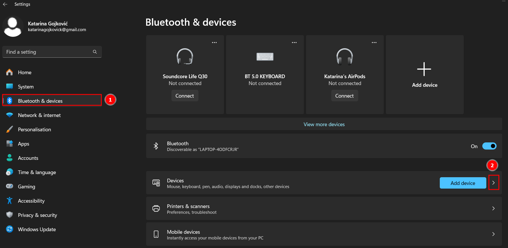
2.  **Access Device Settings**:

    -   Under `Related settings`, select `More devices and printer settings`.

    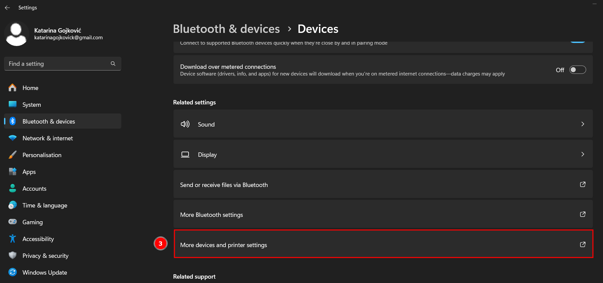

3.  **Control Panel**:

    -   In the `Control Panel`, click on `Add a device`.

    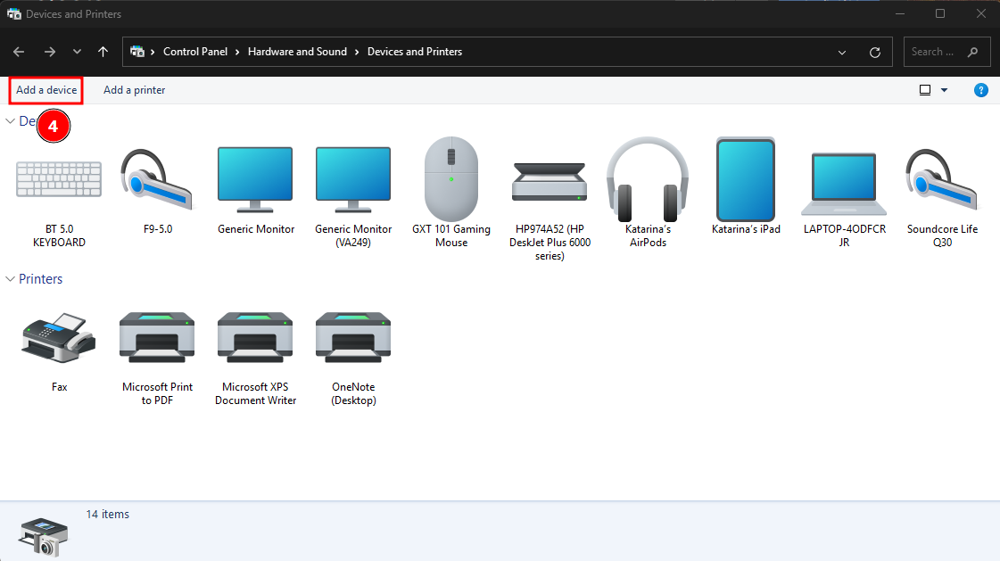

4.  **Pairing the Wii Balance Board**:
    -   Press the red sync button on the Wii Board (near the batteries).
    -   Wait for the device to appear on your computer, and select it.
        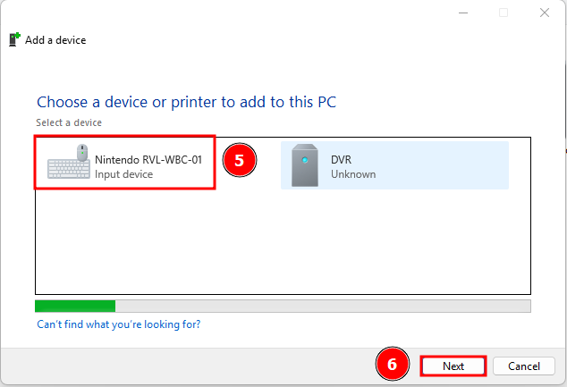
5.  **Skip Password**:

    -   When prompted for a password, **do not enter any password** and click `Next`.
    -   **Important:** If you attempt to enter a password and it doesn’t work, remove the device and repeat the pairing process.

    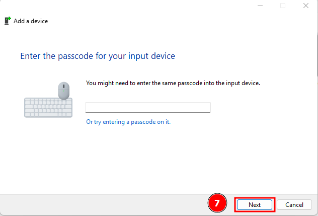

6.  **Completion**: - The device is now connected to your computer.
    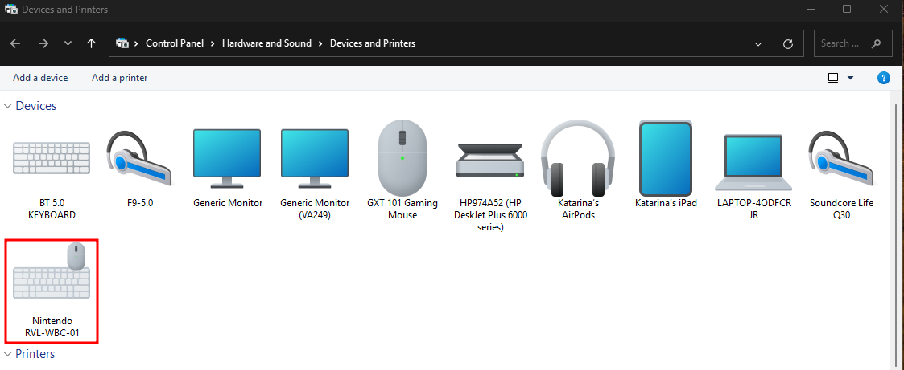
    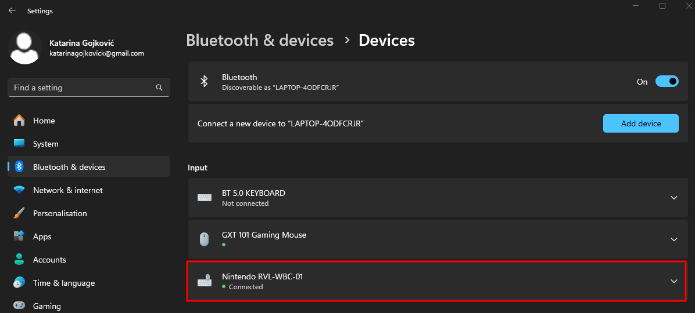

---

## 2. **Running the Visualization Application**

Once the Wii Balance Board is properly connected, follow these steps to launch the visualization application:

1. **Execute the Application**:

    - Navigate to the project folder.
    - Inside the `BUILD` folder, find and run the executable file: `IOI_Projekt.exe`.

2. **Configuration Files**:
    - There are three important JSON configuration files located in the `BUILD/IOI_Projekt_Data/StreamingAssets` folder:
        - `bassNetRegistrationJSON.txt`: Enter your email and registration key for the BASS.NET API. Get the key from [BASS.NET registration](http://bass.radio42.com/bass_register.html).
        - `configRadioJSON.txt`: Configure weight categories and radio stations.
        - `configVisualizationJSON.txt`: Configure visualization settings for the application.

**Important**: Ensure the format of these files is maintained when editing.

---

## 3. **Configuration File Parameters**

Here is an explanation of the parameters used in the JSON configuration files:

### 3.1 **bassNetRegistrationJSON.txt**

-   This file requires you to input an email (`email`) and a registration key (`key`) for BASS.NET API. The key can be obtained at [BASS.NET registration](http://bass.radio42.com/bass_register.html).
    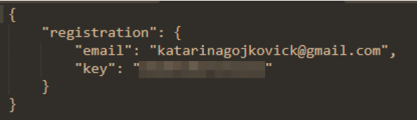

### 3.2 **configRadioJSON.txt**

-   This file allows you to define weight categories (`weight`) and manage the list of radio stations (`radio`) for each category.
-   Ensure that the `toll` field for each radio station is set to 0 when configuring stations.
    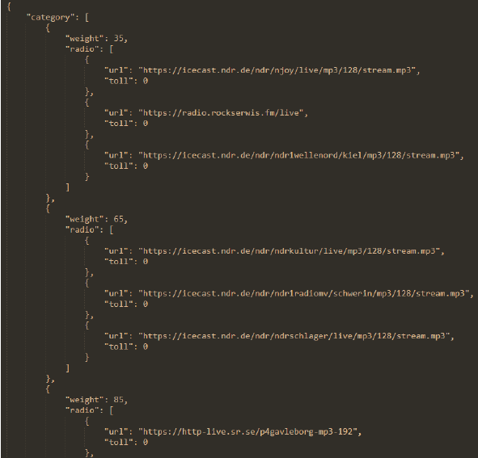

### 3.3 **configVisualizationJSON.txt**

-   **axis**: Set to `1` to display coordinate axes on the board, or `0` to hide them.
-   **colorMode**: Configures how lines are colored in the visualization:
    -   `0`: Lines are half red and half green.
    -   `1`: Lines are colored based on pressure difference between previous and current readings.
    -   `2`: Lines are green if current pressure is greater than or equal to the previous, else red.
-   **maxLines**: Specifies the maximum number of lines displayed on screen.
-   **duration**: Determines how long each line stays on screen (in seconds).

    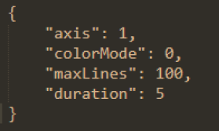

**Note**: After modifying any configuration file, restart the application to apply the changes.

---

## 4. **Interactive Configuration Changes Using the Keyboard**

You can change parameters directly in the application using keyboard shortcuts:

-   **axis**: Press `A` to toggle between showing or hiding coordinate axes.
    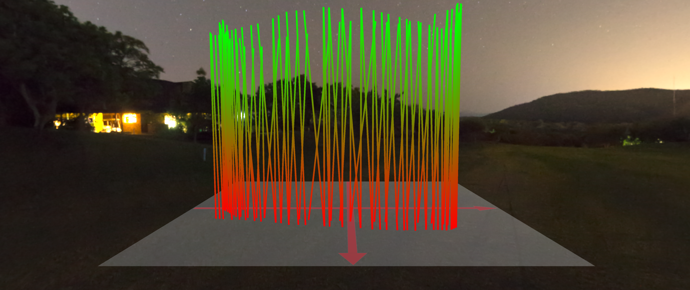
    

-   **colorMode**: Press `C` to cycle through color modes (0, 1, 2).
    
    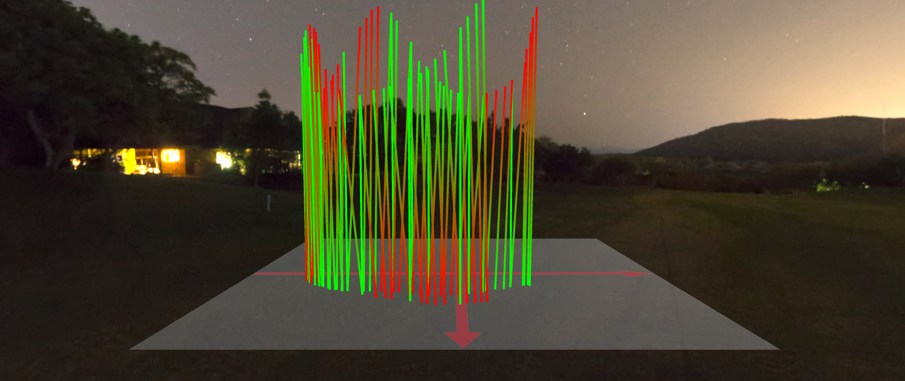
    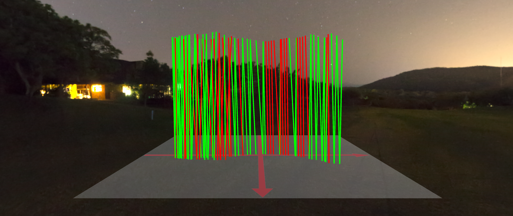
-   **maxLines**: Press `L` to adjust the maximum number of lines visible on screen. Use the arrow keys to increase/decrease by 10.
-   **duration**: Press `T` to adjust the duration for which lines remain on screen. Use the arrow keys to increase/decrease by 1 second.
    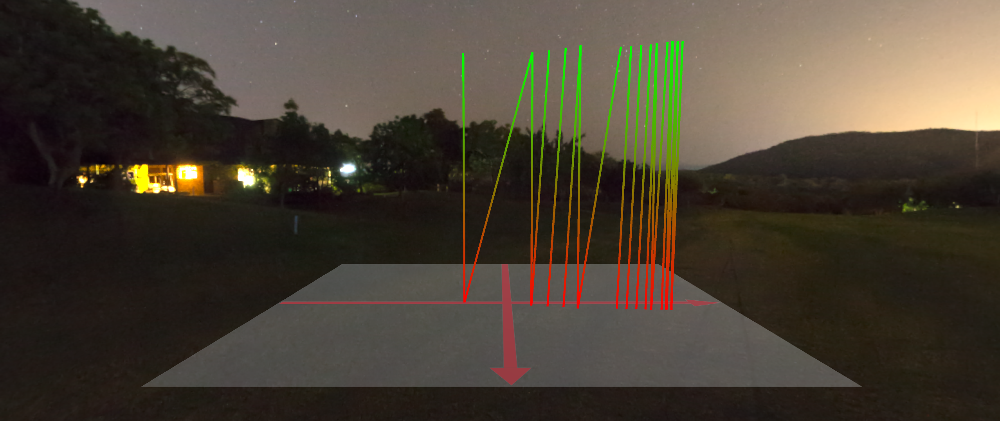

**Note**: For full functionality, we recommend that you decrease the `maxLines` and `duration` settings when no one is on the board, otherwise the changes will only be noticeable when the next user steps on the board (for `maxLines`) or the `duration` setting will apply to newly drawen lines. When increasing, the `maxLines` parameter will work correctly even if the user is on the board, and for the `duration` parameter applies the same as when decreasing.

### 4.1 **Debug Mode**

Press the `D` key to enable Debug mode, which displays additional information at the bottom of the screen:

-   Battery status of the Wii Balance Board.
-   Current weight on the board.
-   x, y, z, and w sensor values.
-   User's category for radio station playback.
-   URL of the currently playing radio station.
-   Parameters from the `configVisualizationJSON.txt` file.

---

## 5. **Exiting the Application**

To close the application, simply press the `Escape` key.

---
